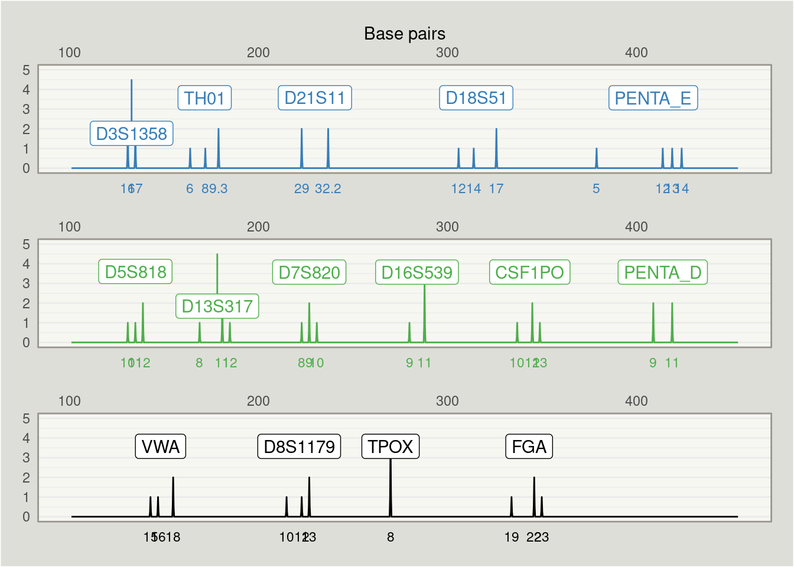

<!-- README.md is generated from README.Rmd. Please edit that file -->

# strbasehelper

<!-- badges: start -->
<!-- badges: end -->

`strbasehelper` is a package designed for helping pre-processing and
plotting gene profile data using information from
[STRBase](https://strbase.nist.gov/).

## Installation

You can install the development version of strbasehelper from
[GitHub](https://github.com/) with:

``` r
# install.packages("devtools")
devtools::install_github("bartonicek/strbasehelper")
```

## Example

Here’s how we can use `strbasehelper` to match our own profile data with
base-pair data from [STRBase](https://strbase.nist.gov/) and plot it:

``` r
library(strbasehelper)
library(ggplot2)

# Start with profile data: a long dataframe with the counts of alleles within loci
dplyr::glimpse(profile_data_long)
#> Rows: 40
#> Columns: 4
#> $ locus  <chr> "CSF1PO", "CSF1PO", "CSF1PO", "D13S317", "D13S317", "D13S317", …
#> $ colour <chr> "green", "green", "green", "green", "green", "green", "green", …
#> $ allele <dbl> 10.0, 12.0, 13.0, 8.0, 11.0, 12.0, 9.0, 11.0, 12.0, 14.0, 17.0,…
#> $ n      <int> 1, 2, 1, 1, 2, 1, 1, 3, 1, 1, 2, 2, 2, 2, 2, 1, 1, 2, 1, 2, 1, …

# Create a ProfileManager object
profile_manager <- ProfileManager$new(profile_data_long)

# The object retains a copy of the profile
dplyr::glimpse(profile_manager$profile_data)
#> Rows: 40
#> Columns: 4
#> $ locus  <chr> "CSF1PO", "CSF1PO", "CSF1PO", "D13S317", "D13S317", "D13S317", …
#> $ colour <chr> "green", "green", "green", "green", "green", "green", "green", …
#> $ allele <dbl> 10.0, 12.0, 13.0, 8.0, 11.0, 12.0, 9.0, 11.0, 12.0, 14.0, 17.0,…
#> $ n      <int> 1, 2, 1, 1, 2, 1, 1, 3, 1, 1, 2, 2, 2, 2, 2, 1, 1, 2, 1, 2, 1, …

# Use the ProfileManager object to fetch data tables from STRBase
# (fetches tables for all loci in the profile data by default), 
# and automatically match base pair data with the profile data
profile_manager$fetch_strbase_tables()
#> Fetching CSF1PO...   [1/15]
#> Fetching D13S317...  [2/15]
#> Fetching D16S539...  [3/15]
#> Fetching D18S51...   [4/15]
#> Fetching D21S11...   [5/15]
#> Fetching D3S1358...  [6/15]
#> Fetching D5S818...   [7/15]
#> Fetching D7S820...   [8/15]
#> Fetching D8S1179...  [9/15]
#> Fetching FGA...      [10/15]
#> Fetching PENTA_D...  [11/15]
#> Fetching PENTA_E...  [12/15]
#> Fetching TH01...     [13/15]
#> Fetching TPOX...     [14/15]
#> Fetching VWA...      [15/15]
profile_manager$extract_basepairs()

ggplot(profile_manager$profile_data, aes(x = base_pairs, y = n)) +
  geom_line(stat = "allele_spike") +
  facet_wrap(~ colour, nrow = 3)
```


