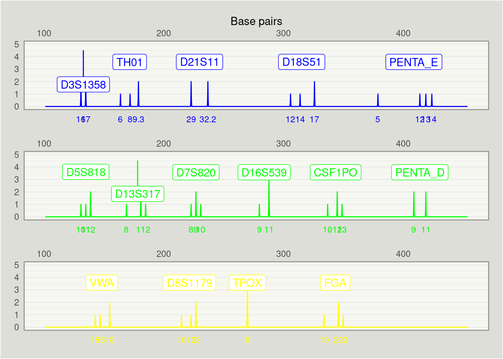

<!-- README.md is generated from README.Rmd. Please edit that file -->

# strbasehelper

<!-- badges: start -->
<!-- badges: end -->

`strbasehelper` is a package designed for helping pre-processing and
plotting gene profile data using information from
[STRBase](https://strbase.nist.gov/).

## Installation

You can install the development version of strbasehelper from
[GitHub](https://github.com/) with:

``` r
# install.packages("devtools")
devtools::install_github("bartonicek/strbasehelper")
```

## Example

Here’s how we can use `strbasehelper` to match our own profile data with
base-pair data from [STRBase](https://strbase.nist.gov/) and plot it:

``` r
library(strbasehelper)

# Start with profile data: a long dataframe with the counts of alleles within loci
dplyr::glimpse(profile_data_long)
#> Rows: 40
#> Columns: 4
#> $ locus  <chr> "CSF1PO", "CSF1PO", "CSF1PO", "D13S317", "D13S317", "D13S317", …
#> $ colour <chr> "green", "green", "green", "green", "green", "green", "green", …
#> $ allele <dbl> 10.0, 12.0, 13.0, 8.0, 11.0, 12.0, 9.0, 11.0, 12.0, 14.0, 17.0,…
#> $ n      <int> 1, 2, 1, 1, 2, 1, 1, 3, 1, 1, 2, 2, 2, 2, 2, 1, 1, 2, 1, 2, 1, …

# Create a ProfileManager object
profile_manager <- ProfileManager$new(profile_data_long)

# The object retains a copy of the profile
dplyr::glimpse(profile_manager$profile_data)
#> Rows: 40
#> Columns: 4
#> $ locus  <chr> "CSF1PO", "CSF1PO", "CSF1PO", "D13S317", "D13S317", "D13S317", …
#> $ colour <fct> green, green, green, green, green, green, green, green, blue, b…
#> $ allele <dbl> 10.0, 12.0, 13.0, 8.0, 11.0, 12.0, 9.0, 11.0, 12.0, 14.0, 17.0,…
#> $ n      <int> 1, 2, 1, 1, 2, 1, 1, 3, 1, 1, 2, 2, 2, 2, 2, 1, 1, 2, 1, 2, 1, …

# Use the ProfileManager object to fetch data tables from STRBase
# (fetches tables for all loci in the profile data by default).

# You can specify which loci to fetch...
profile_manager$fetch_strbase_tables(loci = c("CSF1PO", "D13S317"))
#> Fetching CSF1PO...   [1/2]
#> Fetching D13S317...  [2/2]

# ...or how many...
profile_manager$fetch_strbase_tables(n = 5)
#> CSF1PO is already fetched & will be skipped (run with `refetch = TRUE` if intentional)
#> D13S317 is already fetched & will be skipped (run with `refetch = TRUE` if intentional)
#> Fetching D16S539...  [3/5]
#> Fetching D18S51...   [4/5]
#> Fetching D21S11...   [5/5]

# ...or just all of the loci in the data. Tables that have already been
# fetched are automatically skipped unless we add the argument `refetch = TRUE`
profile_manager$fetch_strbase_tables()
#> CSF1PO is already fetched & will be skipped (run with `refetch = TRUE` if intentional)
#> D13S317 is already fetched & will be skipped (run with `refetch = TRUE` if intentional)
#> D16S539 is already fetched & will be skipped (run with `refetch = TRUE` if intentional)
#> D18S51 is already fetched & will be skipped (run with `refetch = TRUE` if intentional)
#> D21S11 is already fetched & will be skipped (run with `refetch = TRUE` if intentional)
#> Fetching D3S1358...  [6/15]
#> Fetching D5S818...   [7/15]
#> Fetching D7S820...   [8/15]
#> Fetching D8S1179...  [9/15]
#> Fetching FGA...      [10/15]
#> Fetching PENTA_D...  [11/15]
#> Fetching PENTA_E...  [12/15]
#> Fetching TH01...     [13/15]
#> Fetching TPOX...     [14/15]
#> Fetching VWA...      [15/15]

# Next, we can match the STRbase with the profile data, using a specific multiplex
profile_manager$extract_basepairs(multiplex = "PowerPlex 16")

# Finally, we can use plotting method to make a nice-looking ggplot2 plot...
profile_manager$profile_plot()
```


``` r

# Change colours if necessary
profile_manager$profile_plot(col = c(blue = "blue", green = "green", yellow = "yellow"))
```



``` r

# (the plotting is equivalent to the following code)

cols <- c(blue = "#377eb8", green = "#4daf4a", yellow = "black")

library(ggplot2)
profile_data <- profile_manager$profile_data
profile_data$colour <- factor(profile_data$colour, levels = names(cols))
max_count <- max(profile_data$n)

profile_data <- subset(profile_data, !is.na(base_pairs))
max_count <- max(profile_data$n)

ggplot2::ggplot(profile_data, ggplot2::aes(x = base_pairs, y = n, col = colour)) +
  ggplot2::geom_line(stat = "allele_spike") +
  ggrepel::geom_label_repel(ggplot2::aes(group = locus, y = max(n) + 0.5, label = locus),
             stat = "summary", fun = "mean", orientation = "y", direction = "y") +
  ggplot2::geom_text(ggplot2::aes(y = -Inf, label = allele), vjust = 2, size = 3) +
  ggplot2::scale_x_continuous(position = "top") +
  ggplot2::scale_color_manual(values = col[levels(profile_data$colour)]) +
  ggplot2::ylim(0, max_count + 1) +
  ggplot2::coord_cartesian(clip = "off") +
  ggplot2::facet_wrap(~ colour, nrow = 3, scales = "free_x") +
  ggplot2::labs(x = "Base pairs", y = NULL) +
  ggplot2::guides(col = "none") +
  ggplot2::theme_bw() +
  ggplot2::theme(axis.ticks = ggplot2::element_blank(),
        strip.background = ggplot2::element_blank(),
        strip.text = ggplot2::element_blank(),
        panel.grid.major.x = ggplot2::element_blank(),
        panel.grid.minor.x  = ggplot2::element_blank(),
        panel.background = ggplot2::element_rect(fill = '#F7F7F2'),
        panel.border = ggplot2::element_rect(fill = NA, colour = '#999690'),
        panel.spacing = ggplot2::unit(2, "lines"),
        plot.margin = ggplot2::unit(c(1, 1, 2, 1), "lines"),
        plot.background = ggplot2::element_rect(fill = "#DEDED9"))
```
